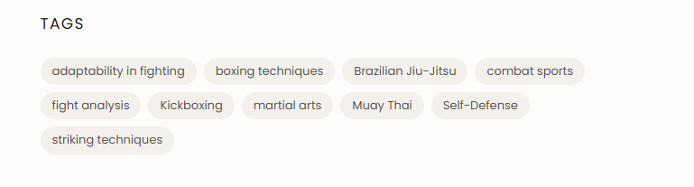

# Sixth Sense Martial Arts Website

## Project purpose

This repository contains the public website for Sixth Sense Martial Arts. Keep the site fast, accessible, locally relevant, and useful before adding visual polish.

## Working conventions

- Prefer semantic HTML, progressive enhancement, and small dependency-free solutions.
- Keep public files and deployed files in `dist/`; the repository root contains project configuration and documentation.
- Document decisions and content requirements in `project-docs/`.
- Store reusable project memory in `memory/`; do not store secrets or personal data.
- Preview with `php -S localhost:8000 router.php` when PHP is available.

## Discoverability requirements

Every indexable page must have a unique title, meta description, canonical URL, one clear H1, descriptive headings, useful internal links, Open Graph metadata, and structured data appropriate to the page. See `project-docs/seo-aeo-feo.md` before publishing content.

## File workflow: edit in place, do not create new files

- **One file per page.** Each page gets a single HTML file in `dist/` for the life of the project (e.g. `dist/adult-bjj-classes.html`). One shared `styles.css` and one shared `main.js` for the project; do not create per-page stylesheets or scripts unless explicitly asked.
- **When asked for changes, edit the existing file.** Never create a new version alongside it. Do not produce files like `*-v2.html`, `*-new.html`, `*-updated.html`, `*-fixed.html`, `*-final.html`, `preview-2.html`, or `index-copy.html`.
- **Before creating any file, check whether one already exists for that page in `dist/`.** If it does, edit it directly.
- **Never create a new file on your own judgment.** If a new file genuinely seems needed, ask first and explain why.
- **`dist/` holds deployed files only**: HTML, CSS, JS, images, PHP, config. Zero `.md` files. All notes, planning, and drafts go in `project-docs/`. This also means no local-preview snapshot files, backups, or test variants in `dist/`; if a preview mechanism is needed, ask how the user wants it handled rather than adding another file there.

## Shared footer component (standing rule, no exceptions)

The footer markup is duplicated in all pages. If it changes, it must be updated in EVERY page file identically. All footer styling lives in `dist/styles.css` (in a `.site-footer`-scoped block at the end of the file), linked from every page's `<head>` **before** that page's own per-page stylesheet — a design change means editing that one CSS file, not five HTML files. Load order matters: `styles.css` must come first so each page's own stylesheet still wins for its own fonts/colors everywhere outside the footer; only the `.site-footer`-scoped rules are meant to come from `styles.css`. The HTML itself must contain zero inline styles.

There is no PHP include, no build step, and no templating for the footer — this project stays pure static HTML. (An earlier attempt used a PHP include; it was reverted because this environment has no PHP installed and pages are plain `.html`, so the include never executed. Do not reintroduce a PHP/JS-injected footer without being asked.)
